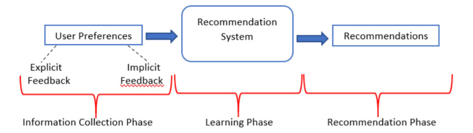
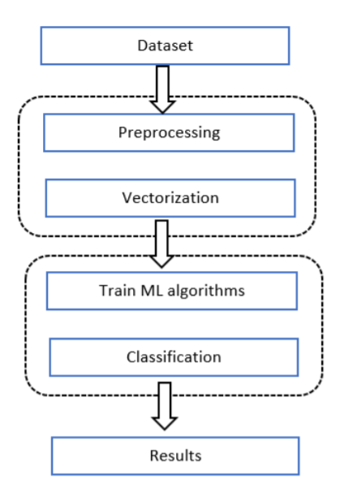

# Movie-Recommendation-System-with-Sentiment-analysis

## Introduction
Big Data has become one of the most prominent buzzwords in recent years with good reason. With the increasing amount of data people want to explore more relevant and interesting data. Here comes the role of recommendation systems where its role is to personalize the content and identify the relevant data to the users. Along with big data and machine learning as a trending research field, natural language processing is very helpful to classify and predict the content of language. And one of the prominent areas in NLP is sentiment analysis, sentiment analysis is defined as to identify the emotion, feeling, polarity and attitude of the written sentence or
document.

Our project aims to build an application combining both, where we developed an web application for movie recommendation system with sentiment analysis of movie reviews. This report first goes through a detailed analysis of the recommendation system including the phases involved in, various filtering techniques, models used and a small comparative analysis of various machine learning algorithms and their performance on sentiment analysis tasks and finally a quick implementation and results of our project.

## Dataset ##
The dataset is taken from kaggle IMDB movie review dataset with only positive and negative labelled reviews. The dataset consists of 7086 reviews among which 3995 reviews are positive i.e. around 56%. The label to each review is assigned as either 1 for positive or 0 for negative. We then split the dataset into 80:20 ratio for training and testing purposes.

1. https://www.kaggle.com/carolzhangdc/imdb-5000-movie-dataset
2. https://en.wikipedia.org/wiki/List_of_American_films_of_2018
3. https://en.wikipedia.org/wiki/List_of_American_films_of_2019
4. https://en.wikipedia.org/wiki/List_of_American_films_of_2020
5. https://www.kaggle.com/rounakbanik/the-movies-dataset

## Methodology ##
### Recommendation System

The recommendation system is similar to any machine learning problem, in machine learning we need data which is sent to learning algorithms/models which processes the data and outputs the predictions. In our case the data is in the form of feedback from the users which is passed to a recommendation system where the learning model is implemented and produces the recommendation of users interest.

### Sentiment Analysis

The methodology employed for this task is as follows: First the IMDB reviews dataset is collected
which is passed for data preprocessing followed by vectorization process. After which the
Machine Learning algorithms are used to train the model and classify the reviews and finally the
results are displayed.
The steps/methodology used is shown in the following figure and we will briefly go through each
step:

## Implementation 

Step 1: The movie dataset is collected till 2020 and preprocessed to form a user-item matrix.

Step 2: Similarly, the movie review data is collected, and next steps are followed for building a classification as discussed in the methodology of sentiment analysis section.

Step 3: The recommendation model is built using collaborative filtering technique and matrix factorization model. The similarity scores are calculated using cosine similarity.

Step 4: The web application is designed using HTML, CSS and JavaScript and deployed on Heroku. The information regarding the movie and reviews are taken from IMDB website through web scraping and TMDB API.

Following are some screenshots of the application:

## Conclusion

The report proposes the methodology for a movie recommendation system and sentiment analysis of IMDB movie reviews. Other deep learning methods for collaborative filtering can be implemented to compare with the results of matrix factorization method used. The results from movie reviews sentiment analysis shows that logistic regression and naive bayes perform better than SVM and random forest classifier. The accuracy of SVM and random forest can be improved by performing hyperparameter tuning as SVM is one of the best algorithm for classification problems. Lastly, we can implement other vectorization techniques and other classification algorithms including neural networks and perform a deep comparative analysis.

## References
1. F.O. Isinkaye, Y.O. Folajimi, B.A. Ojokoh. Recommendation Systems: Principles, methods and evaluation. DOI:https://doi.org/10.1016/j.eij.2015.06.005
2. Bobadilla, J., Ortega, F., Hernando, A., & Gutiérrez, A. (2013). Recommender systems survey. Knowl. Based Syst., 46, 109-132.
3. Jian Shen, Yan Wie, Yupu Yang. Collaborative filtering recommendation algorithm based on two stages of similarity learning and its optimization
4. A. Tripathy, A. Agrawal, and S. K. Rath, “Classification of Sentimental Reviews Using Machine Learning Techniques”, 3rd International Conference on Recent Trends in Computing 2015 (ICRTC2015), Procedia Computer Science, vol. 57, 2015, pp. 821 – 829
